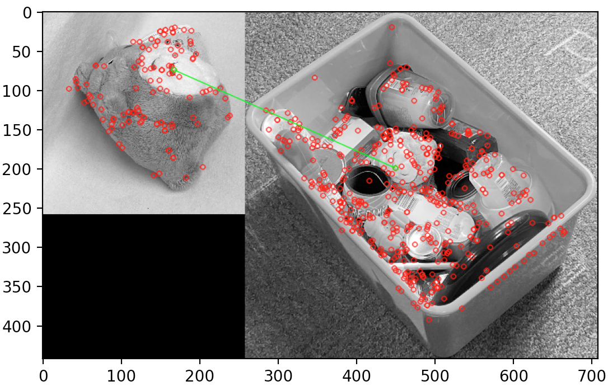
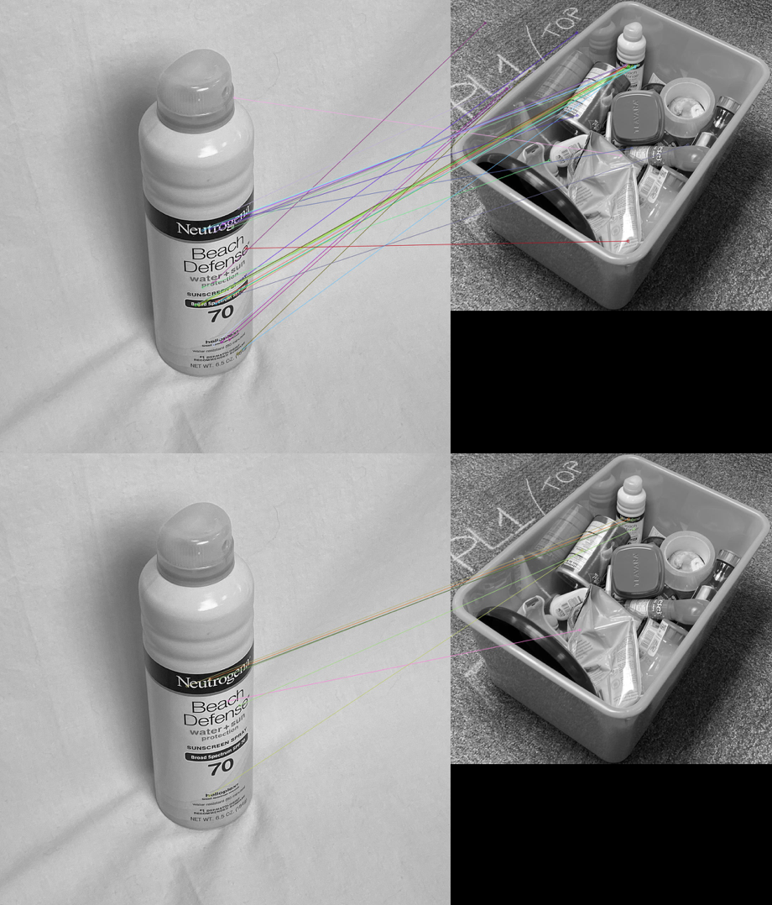

# CSE 40536/60536 Term Project: Object Detection in a Dense Cluster for Amazon Robotics

## Alden's Keypoint-Based Approach

## (a) Methods and Models

I was motivated to attempt solutions that did not require deep learning for object detection.  I also wanted to incorporate traditional computer vision methods to achieve higher detection accuracy. Methods and models that I used are:
1. Segmenting the image for the bin based on color
2. Scale Invariant Feature Transform (SIFT) keypoint descriptor matching
3. CNN-based keypoint descriptor matching

**Generating Masks for Bins**

As this project presented object detection in an engineered environment (i.e. bin of known size and color), using this information to occlude background noise (e.g. floor around bin, carpet, edges of the bin) is a practical means of removing spurious detections. I achieved this by segmenting the image for all 'H' values in the HSV color space within a range of [50,76]. The function `generate_bin_mask(img)` in `alden_cv2_functions.py` achieves this. It takes an RGB image as an argument, and returns a 1-channel mask for the bin.

!Generated Masks for Bins](/report_images/masks.png)

Figure 1. Sample of Generated Masks for Bins

**SIFT**

[SIFT](https://www.cs.ubc.ca/~lowe/papers/ijcv04.pdf), by Dr. David Lowe, provides feature descriptors of length 128. It uses a difference-of-Gaussians (DoG) function for detecting salient keypoints in an image. It is widely used for image stitching (panoramas, stereovision cameras), but can be applied to object detection.

SIFT and other keypoint detectors require no learning, are robust to occlusion (i.e. they look for matched keypoints, not whole objects), and are fast to run (i.e. no GPU parallelism required). They fall short in that they can't generalize to classes of objects. For a keypoint detector to properly detect an object, it has to be nearly identical to the object in the reference/training library. SIFT is good for detection of a specific make/model product, but poor for general object detection (e.g. it might detect "Nike Air Force Ones", but would not be able to give the class label "Shoes")

Figure 2. SIFT Keypoint Matching for "Fuzzy"

**CNN-Based Keypoint Descriptor Matching**

To account for the inadequacies of SIFT and other deterministic keypoint matchers, I used [Balntas' et al.'s "Learning local feature descriptors with triplets and shallow convolutional neural networks"](https://github.com/vbalnt/tfeat) to experiment with CNN-based replacements for generating feature descriptors. Their model, `tfeat`, uses a deterministic keypoint detector (e.g. SIFT, BRISK) to generate keypoints for an image, then samples a patch around the keypoint to generate a replacement descriptor. It is trained on the [Phototour Dataset](http://phototour.cs.washington.edu/patches/default.htm), which has ground-truthed matched patches from architecture (e.g. matching points from different photos of Notre Dame Cathedral). It is similar to the work of [Han et al. (MatchNet)](https://www.cv-foundation.org/openaccess/content_cvpr_2015/papers/Han_MatchNet_Unifying_Feature_2015_CVPR_paper.pdf) and [Simo-Serra et al.](https://www.cv-foundation.org/openaccess/content_iccv_2015/papers/Simo-Serra_Discriminative_Learning_of_ICCV_2015_paper.pdf) I chose this work because of their open-source, easy to implement network.

CNN-based keypoint descriptors are good inasmuch as once descriptors are generated for an object and bin, they can be matched without GPU parallelism. They move towards higher fidelity than SIFT/SURF/BRISK, while still maintaining a lower computing cost than pure deep-learning object detection (e.g. Mask R-CNN, YOLOv3, SSDs). An example usage of this is shown below.

Figure 2. Tfeat Removing Spurious Matches from BRISK Detector in Top Image, Matching CNN-Based Descriptors in Bottom Image

## (b) Experiments Conducted

Early experiments with SIFT showed that it is prone to spurious matches, as seen in Figure 3.

Figure 3. Spurious Matches w/ SIFT

To combat spurious matches, I qualitatively experimented with the frequency of the DoG detector. I lowered the frequency of the detector by setting the contrast threshold to 0.06, as opposed to Lowe's stock value of 0.04, which aided in removing spurious matches to the carpet and other objects. Using openCV 3.4.2.16, this is implemented as `sift = cv2.xfeatures2d.SIFT_create(contrastThreshold = 0.06, edgeThreshold = 10)`

With the previously described masking procedure for bins and a lower frequency keypoint detector, I had a better SIFT implementation for this challenge. Figure 4 shows fewer keypoints in a well-cropped image, with a lack of keypoints outside the bin from the mask.

Figure 4. SIFT Matcher Working Well due w/ Lower Frequency Detector, No Keypoints Outside Bin from Mask

I generated a library of SIFT descriptors for the 11 classes in our dataset (`['Paintbrush', 'Spray_Sunscreen', 'Rub_Sunscreen', 'Dice_Container', 'Tape', 'Cetaphil', 'Sunglasses', 'Pillbottle', 'Fuzzy', 'Marker', 'Frisbee']`) by randomly sampling 1, 3, 5, 7, and 9 distinct mobile images containing only the object of interest, generating SIFT descriptors for them, and then appending the descriptors together in `.npy` files. These are housed in the `sift_descriptor_library` directory. This allowed me to experiment with the amount of training data needed to get reasonable accuracy for SIFT matching. Descriptor files with fewer training images have less information from different orientations of the objects of interest.

In generating descriptor libraries of known objects and matching object images to bin images, I rescaled object images to be 20% of their original size,  while scaling bin images to be 60% of their original size. I hypothesized that keypoint detectors would work better if the object was a similar size in the training/reference images as it was in the bin, so scaling the object image to be approximately 1/3 the size of the bin was a way to achieve this.

For matching SIFT descriptors, I used openCV's `cv2.FlannBasedMatcher` (Fast Library for Approximate Nearest Neighbors), which implements a fast knn matcher for feature descriptors. I further applied Lowe's Ratio Test to sort for good matches. This test removes spurious keypoint matches by taking the ratio of the Euclidean distance of the two closest knn matches to a point of interest (i.e. the two nearest descriptors to a descriptor being matched), then counting the match as good if it is lower than a set threshold, and bad if it is above this threshold. The intuition here is that "strong" or true matches are more likely to be distinct (i.e. lower Euclidean distance to the point of interest) than spurious matches. Lowe proposed a threshold of 0.8 in his paper, but I experimented with lower values (e.g. 0.6, 0.7) for higher precision. After performing Lowe's Ratio Test, I also ignored objects that only had one matches descriptor.

I had early challenges with the knn matcher – I was initially matching the bin descriptors to the object descriptors, instead of the object descriptors to the bin descriptors. Results I was getting seemed nonsensical (the precision/recall curves didn't align with what I expected) – but I learned that **finding the nearest neighbors of a descriptor from the bin is not the same as finding the nearest neighbors of a descriptor from the library of known objects.** Looking for the nearest neighbors of bin descriptors results in crowding of the knn matcher and poor separation of feature descriptors – the knn matcher is more likely to match descriptors of non-interest (e.g. edge of bin) to the descriptors of interest (those of the known objects). **For keypoint matching in a dense cluster, object descriptors should be matched to bin descriptors, rather than bin descriptors to object descriptors**

After sorting all of this out, I ran experiments that performed SIFT descriptor matching for 1, 3, 5, 7, and 9 training object images to the bin descriptors generated for an image, and did so for Lowe's Ratio Test values of 0.6 and 0.7. The results are detailed in Tables 1 and 2.

**SIFT Experimental Results**

|Train Images| Runtime on Intel Core i7 (s)|True Positives|False Positives|False Negatives|Precision (%)|Recall (%)|
|----------- | ------------- |------------- | ----------- | ------------- | ----------- | -------------|
|1 | 9.47 | 20 | 4 | 411 | 83.33 | 4.64|
|3 | 12.27 |63 | 15 | 368 | 80.77 | 14.62|
|5 | 12.10 |77 | 26 | 354 | 74.76 |17.87|
|7 | 13.51 |100 | 38 | 331 | 72.46 | 23.20|
|9 | 16.17 |119 | 54 | 312 | 68.79 | 27.61|

Table 1. SIFT Matching Results w/ Lowe's Ratio Test @ 0.6

|Train Images| Runtime on Intel Core i7 (s)|True Positives|False Positives|False Negatives|Precision (%)|Recall (%)|
|----------- | ------------- |------------- | ----------- | ------------- | ----------- | -------------|
|1 | 9.95 | 71 | 27 | 360 | 72.45 | 16.47|
|3 | 12.85 | 221 | 121 | 210 | 64.62 | 51.28|
|5 | 12.21 | 253 | 154 | 178 | 62.16 | 58.70|
|7 | 13.89 | 306 | 181 | 125 | 62.83 | 71.00|
|9 | 17.26 | 348 | 199 | 83 | 63.62 | 80.74|

Table 2. SIFT Matching Results w/ Lowe's Ratio Test @ 0.7

In examining convolutional feature descriptors (housed in `tfeat_descriptor_library`), I generated descriptor libraries of the same structure as those for SIFT, then ran experiments identical to those for SIFT. I wanted to compare the precision/recall of these descriptors to those of SIFT, and well as prod how effective these descriptors were as more training data was added.

**CNN-Based Descriptors (tfeat) Experimental Results**

|Train Images| Runtime on Nvidia GTX 1080(s)|True Positives|False Positives|False Negatives|Precision (%)| Recall (%)|
|----------- | ------------- |------------- | ----------- | ------------- | ----------- | -------------|
|1 | 33.59 | 1 | 0 | 430 | 100.00 | 0.23|
|3 | 37.84 | 1 | 1 | 430 | 50.00 | 0.23|
|5 | 47.97 | 7 | 1 | 424 | 87.50 | 1.62|
|7 | 56.75 | 6 | 1 | 425 | 85.71 | 1.39|
|9 | 70.89 | 8 | 3 | 423 | 72.73 | 1.86|

Table 3. tfeat Matching Results w/ Lowe's Ratio Test @ 0.6

|Train Images| Runtime on Nvidia GTX 1080(s)|True Positives|False Positives|False Negatives|Precision (%)|Recall (%)|
|----------- | ------------- |------------- | ----------- | ------------- | ----------- | -------------|
|1 | 32.00 | 28 | 3 | 403 | 90.32 | 6.50|
|3 | 37.26 | 30 | 5 | 401 | 85.71 | 6.96|
|5 | 47.43 | 67 | 13 | 364 | 83.75 | 15.55|
|7 | 56.29 | 83 | 17 | 348 | 83.00 | 19.26|
|9 | 77.26 | 112 | 26 | 319 | 81.12 | 25.99|

Table 4. tfeat Matching Results w/ Lowe's Ratio Test @ 0.7

## (c) Detection Accuracy

My methods used no bin images for training, so reported accuracy metrics are run on test sets that include all mobile bin images. I used precision and recall to quantify accuracy, as these are common in computer vision/pattern recognition and were suitable for the method by which I was determining true and false positives. 
-A "true positive" occurred if the object's descriptor file was matched to the descriptors from the bin and the object was present in the ground truth labels for the bin
-A "false positive" occured if the object's descriptor file was matched and the object wasn't present in the ground truth labels for the bin
-A "false negative" occured if the object's descriptor file wasn't matched, but was present in the ground truth labels for the bin.  

**Note:** this method of determining true positives can still admit to spurious matches, i.e. if an object (say Spray_Sunscreen) was matched to a bin and present in the corresponding ground truth labels file, it could have been spuriously matched to another object in the bin (e.g. Frisbee).  I did not perform a check to ensure that the matched keypoint corresponded to the bounding box from this object. The true precision and recall of my experiments is likely lower than reported in Tables 1 - 5. For this reason, I report accuracy metrics in Table 5 using Lowe's Ratio Test @ 0.6, as these experiments are less likely to have spurious "True Positives"

| Descriptors |Precision (%)|Recall (%)|
|-----------|-----------|-----------|
| SIFT | 68.79 | 27.61 |
| tfeat CNN | 72.73 | 1.86 | 

Table 5. Detection Accuracy on Mobile Bins Dataset for 9 Training Images, Lowe's Ratio Test @ 0.6

| Descriptors | Bin Masks Used? | # of False Positives |
|-----------|-----------| -----------|
| SIFT | Yes | 0 |
| SIFT | No | 35 |
| tfeat CNN | Yes | 0 | 
| tfeat CNN | No | 34| 

Table 6. Detection Accuracy on Dr. Czajka's Test Set of 13 Images w/ Worst Case Scenario Results Reported (No Masks for Bins, Background Noise Included, Maximum # of Descriptors)

## (d) Commentary on Observed Accuracy

Ignoring the previously noted experimental flaws in logging true positives, SIFT descriptors and tfeat descriptors both produce spurious matches. They can both achieve decent precision, but both do so with low recall. Increasing the number of training images in the training libraries increases recall, but also increases spurious matches.

**CNN-based keypoint descriptors are useful in matching images, and were shown to have higher precision than SIFT descriptors (Table 4 vs. Table 1), with more permissive values of Lowe's Ratio test.**

When the bin masks were used in the test set, no spurious matches were found – this is a hack, as my mask generation was only configured for green bins (there was one in the test set). When no masks were used in the test set, spurious positives occurred for both the SIFT and CNN-based keypoint descriptors. This shows that both methods, as is, are insufficient for object detection in a dense cluster. However, the use of masks to occlude background noise is effective in removing false positives and matches. 

**Test set results support using top-down information (color, size of bin) about the object detection scene to remove background noise**

Qualitative analysis of images has shown that lower values of Lowe's ratio test are effective in reducing the number of spurious matches.

Spurious matches still occur due to the relatively little amount of information held in a keypoint descriptor. Future work with keypoint descriptors should focus on:

-Composing the SIFT and CNN-descriptor libraries of fewer, but higher strength descriptors (openCV keypoint objects have strength associated with them), as this would give better separation in the feature space of knn matchers for feature descriptors and lead to fewer spurious matches
-Training a new triplet network for CNN-based keypoint descriptors, customized to the task of object detection. I elected to use Balntas et al's open source code here, as creating and training a new model here would have required a massive annotation task of ground-truthing patch pairs on object images. This extended past the scope of the project, but would likely yield better results

--------------------
## Xing's Yolo Transfer Learning Experiments

From our preliminary results, we found that our raw tagged object data was not enough for the system to learn the correct tagging of clustered objects. To run an example of this run the following:
head data/datasets/valid_obj_green.txt | ./darknet cfg/yolov3_objects_only.cfg backup/yolov3_objects_only_final.weights

We also combined the individual object pictures with the tagged bin pictures the results can be seen by run the following:
head data/valid_totes.txt | ./darknet cfg/yolov3_set_aside.cfg backup/yolov3_set_aside_2000.weights
We see that this models is able to tag some of the pictures but is proned to tag the whole bin as frisbee. This lead us to believe that the size of the individual images were too big. Since the neural network is used to seeing the Fribee take up the entire frame it is prone to tag the entire frame as on big frisbee.

To address this we did the following experiments:
1. As a baseline, we looked at a random sample of tagged bin data and how well the system performed if we only used tagged bin data with a random 80/20 split. We found that this gave up the best performance with an IOU of 68.8% overall. 
    - Run the following to see examples: head data/valid_totes.txt | ./darknet cfg/yolov3_totes.cfg backup/yolov3_totes_final.weights
    - For the average IOU run python get_iou.py results/totes/!

  
2. We resized the images of the individual objects and added padding around it so that it would be proportionally similar to what we expect to see in the bin photos. We tried padding it with white pixels similar to the background and combined it with our bin data. Again we do a random 80/20 split and we get an average IOU of 24.5%
    - Run the following to see examples: head data/valid_white.txt | ./darknet cfg/yolov3_resize_white.cfg backup/yolov3_resize_white_final.weights
    - For the average IOU run python get_iou.py results/resize_white/
 

3. We resized those same images but pad with green pixels since our objects are in the green plastic tote. Doing the same thing as in experiment 2 we get an average IOU of 47.42% The improvement here could be due to overfitting so we use both data in further experiments.
    - Run the following to see examples: head data/valid_2.txt | ./darknet cfg/yolov3_resize.cfg backup/yolov3_resize_final.weights
    - For the average IOU run python get_iou.py results/resize_green/
   

To further understand what the neural network is capable of learning from what it can't we divide the bin data based on features of the lighting, angle, and sensor. This is so we can see what has a greater effect on the models abiliy to learn.

4. Ligthing: for this experiment we include resized images along with all bin images taken under al1 lighting conditions. The validation set is thus all the images taken under the other lighting conditions. This we found was challenging for the system to learn because there was only 1/3 of all bin data in training and two different lighting conditions to test for. 
    - head data/datasets/valid_al1.txt | ./darknet cfg/al1_lighting.cfg backup/al1_lighting_final.weights for resized images with white pixel paddings. 
    - To get IOU run python get_iou.py results/al1/ we get 4.6%
    - head data/datasets/valid_al1_green.txt | ./darknet cfg/al1_lighting.cfg backup/al1_lighting_final.weights for resized images with green pixel paddings. 
    - To get IOU run python get_iou.py results/al1_green/ we get 8.5%

5. Angle: for this experiment all top view pictures were added and side view pictures became validation data. We found that this was the hardest condition to learn for the system.
    - head data/datasets/valid_top.txt | ./darknet cfg/top_view_only.cfg backup/top_view_only_final.weights for resized images with white pixel paddings. 
    - To get IOU run python get_iou.py results/top_view/ we get 3.8%
    - head data/datasets/valid_top_green.txt | ./darknet cfg/top_view_green.cfg backup/top_view_green_final.weights for resized images with green pixel paddings. 
    - To get IOU run python get_iou.py results/top_green/ we get 4.8%

6. High Resolution Senors: for this experiment all pictures taken by our mobi were added and all the webcam pictures became validation data. We found that this was the easiest condition to learn for the system.
    - head data/datasets/valid_mobi.txt | ./darknet cfg/mobi.cfg backup/mobi_final.weights for resized images with white pixel paddings. 
    - To get IOU run python get_iou.py results/mobi/ we get 13.47%
    - head data/datasets/valid_mobi_green.txt | ./darknet cfg/mobi_green.cfg backup/mobi_green_final.weights for resized images with green pixel paddings. 
    - To get IOU run python get_iou.py results/mobi_green/ we get 13.97%

7. High Resolution Senors: for this experiment all pictures taken by our mobi were added and all the webcam pictures became validation data. We found that this was the easiest condition to learn for the system.
    - head data/datasets/valid_c615.txt | ./darknet cfg/c615.cfg backup/c615_final.weights for resized images with white pixel paddings. 
    - To get IOU run python get_iou.py results/c615/ we get 5.45%
    - head data/datasets/valid_c615_green.txt | ./darknet cfg/c615_green.cfg backup/c615_green_final.weights for resized images with green pixel paddings.
    - To get IOU run python get_iou.py results/c615_green/ we get 7.84%

The results of test can be seen by running head data/test.txt in any of the above situations in place of the command for looking at validation data. For almost all of these systems none gave us false positives. The exceptions are experiment 3 which mistook part of a blue bin for the frisbee.

 

From these experiments it seem that individual objects alone are not enough for the system to recognize it in the wild. We definitely need some number of in context data. With that it is also very important scale the individual objects such that they aren't disportionally larger than what we expect to see in context. Lastly certain changes are easy for the system to compensate for. For example, going from higher resolution to lower resolution is much easier than the other way around, and varying angles are very hard for the system to recognize. 
 
In regards to the questions this project was set out to answer I found the following: 
 
1.) The minumum amount of information a combination of tagged bins in differing angles layouts and lightning are neccessary to get reliable detection.

2.) Occlusion will hurt the systems because it will expect to tag data in similar in size to what it has seen in training. 

3.) Without doing ablation study we are unsure what the absolute minimum amount of information is needed. The foot print of the model is inevitably large because there are so many weights for the model to learn. Training time is relatively high around 3-4 hours per model. 

4.) This method is robust to illumination, assuming we rescale incoming images it can be rebust to scale, assuming that we have the highest resolution in training it is robust to sensors changes, but it is considerably weaker in rotation. 

5.) Training here is neccessary and experimentally I found that around 2000 epochs is neccessary, at 1000 epochs there is still sign of undertraining and not much changes at 4000 epoch.

6.) This method can be scaled but it does require tagged bin data, without which it rarely detect objects.

7.) Depending on how we expand the categories what new objects share a tag it could scale up. Although it could not detect novel objects.

## Instructions to Run Programs

### Alden's Keypoint-Based Approach

For a demonstration of both SIFT and tfeat matching, I created `kpt_matching_test.py`. The program matches both the SIFT and CNN-based tfeat descriptors to their respective bin descriptors. It uses 9 training objects, and employs Lowe's Ratio Test @ 0.6. For this reason, it is unlikely to match a CNN-based descriptor, as it has low recall (see Table 3).

To run this program:
1. SSH into ND CRC machines, with X forwarding to local machine
    `ssh -X user@crcfe01.crc.nd.edu`
2. Clone this Git and navigate to top-level directory
    `git clone https://github.com/aldenkane/cv2TermProject.git`
3. Obtain access to a GPU with CUDA support
    `qrsh -q gpu -l gpu_card=1`
4. Create a Conda environment with the pertinent requirements. openCV 3.4.2 (not 4.x) is an important requirement, as support for SIFT has been deprecated in newer versions
    `conda create --name alden_cv2 --file alden_requirements.txt`
5. Activate Conda environment
    `conda activate alden_cv2`
6. Change directory to src folder
    `cd src`
7. Run kpt_matching_test.py
    `python3 kpt_matching_test.py`
8. Command line output will show matched SIFT and CNN-Based Descriptors. If X forwarding is configured correctly, matplotlib will show the bin mask and original image
 
All relevant programs that I wrote are housed in `src`. A description of useful programs that I wrote are found below:
-`alden_cv2_functions.py`: Houses helper functions for matching found items to groundtruth labels, generating masks for bins, HSV value segmentation, and other functions that were relevant in running my experiments
-`figure_gen_sift`: Uses SIFT to match one object photo to one bin photo and draws keypoints. Used for creating figures for report
-`figure_gen_tfeat`: Uses tfeat to match one object photo to one bin photo and draws keypoints. Used for creating figures for report
-`generate_SIFT_library`: Used to calculate SIFT descriptors, write them to .npy files, and create libraries of descriptors for experiments
-`generate_tfeat_library`:  Used to calculate tfeat descriptors, write them to .npy files, and create libraries of descriptors for experiments
-`kpt_matching_test`: Test program for Dr. Czajka, Lucas
-`l2b_sift_experiment`: SIFT matching experiment for Tables 1 and 2
-`l2b_sift_test.py`: SIFT matching on Dr. Czajka's test set
-`l2b_tfeat_experiment`: tfeat matching experiment for Tables 3 and 4
-`l2b_tfeat_test.py`: tfeat matching on Dr. Czajka's test set

### Xing's Yolo Transfer Learning Experiments

For yolo transfer learning go into folder darknet_new. The requirements are the same as those in practical 7. To see the popup of the tagged pictures on crc gpu machines:
1. Log into crc via ssh username@crcfe02.crc.nd.edu.
2. Open and interactive session via qsh -q gpu -l gpu=1.
3. Set gpu to an available gpu via setenv CUDA_VISIBLE_DEVICES $SGE_HGR_gpu_card
4. Load cuda and opencv vi module load cuda/10.0 opencv
5. Unzip the folder as long as your running on gpu this should work.

## Consent for Amazon Robotics

We consent to (a) (b) (c), i.e. Amazon Robotics can access our report, source code, and Dr. Czajka's comments.

## Division of Work

Alden did all work regarding keypoint descriptors. Xing did all work regarding YOLO and deep-learning based detection networks. Sections of the report were demarcated by who wrote them.

Collection, cropping, and annotation of datasets was a collaborative effort. We worked in a collaborative team with the free flow of ideas.

## Citations, References, and Acknowledgements

-Thank you to Dr. Adam Czajka and Lucas Parzianello of Notre Dame for their direction, advice, and expertise with this project
-Thank you to Amazon Robotics for their sponsorship of this project
-Balntas et al.'s ["Learning local feature descriptors with triplets and shallow convolutional neural networks"](http://www.bmva.org/bmvc/2016/papers/paper119/paper119.pdf) and its corresponding [open-source code](https://github.com/vbalnt/tfeat) were used for generating CNN-based keypoint descriptors. The `phototour.py`, `tfeat-test.py`, `tfeat_model.py`, and `tfeat_utils.py` programs in the `src` directory are theirs. The models in the `pretrained-models` folder also come from them
-Dr. David Lowe's ["Distinctive Image Features from Scale-Invariant Keypoints"](https://www.cs.ubc.ca/~lowe/papers/ijcv04.pdf) and corresponding SIFT programs were heavily employed in this project
-Han et al.'s ["MatchNet: Unifying Feature and Metric Learning for Patch-Based Matching"](https://www.cv-foundation.org/openaccess/content_cvpr_2015/papers/Han_MatchNet_Unifying_Feature_2015_CVPR_paper.pdf) was a motivating paper for this project
-Simo-Serra et al.'s ["Discriminative Learning of Deep Convolutional Feature Point Descriptors"](https://www.cv-foundation.org/openaccess/content_iccv_2015/papers/Simo-Serra_Discriminative_Learning_of_ICCV_2015_paper.pdf)
-PJ Redmon's [YOLOv3 and Darknet Neural Network](https://pjreddie.com/yolo/) were used Xing's experiments with YOLOv3
