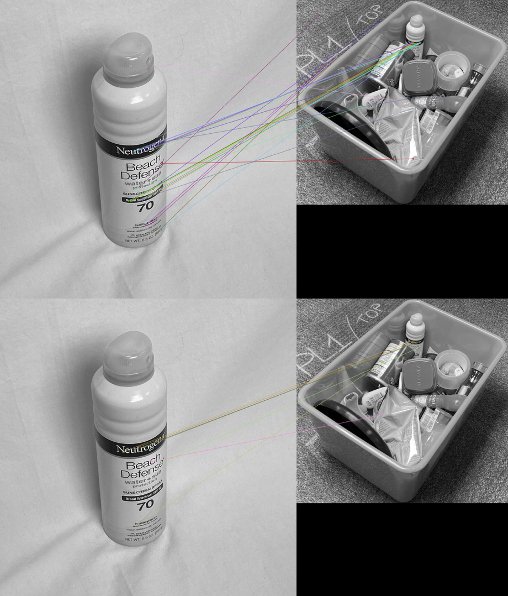

# CSE 40536/60536 Term Project: Object Detection in a Dense Cluster

## (a) Methods and Models

### Alden's Keypoint-Based Approach

I was motivated to attempt solutions that did not require deep learning for object detection.  I also wanted to incorporate traditional computer vision methods to achieve higher detection accuracy. Methods and models that I used are:
1. Segmenting for the tote based on color
2. Scale Invariant Feature Transform (SIFT) keypoint descriptor matching
3. CNN-based keypoint descriptor matching

**Generating Masks for Bins**
As this project presented object detection in an engineered environment (i.e. bin of known size and color), using this information to occlude background noise (e.g. floor around bin, carpet, edges of the bin) is a practical means of removing spurious detections. I achieved this by segmenting the image for all 'H' values in the HSV color space within a range of [50,76]. The function `generate_bin_mask(img)` in `alden_cv2_functions.py`. It takes an RGB image as an argument, and returns a 1-channel mask for the bin.

**Figure 1.** Generated Masks for Bins

**SIFT**

[SIFT](https://www.cs.ubc.ca/~lowe/papers/ijcv04.pdf), by David Lowe, provides feature descriptors of length 128. It is widely used for image stitching (panoramas, stereovision cameras). It uses a difference-of-Gaussians (DoG) function for detecting salient keypoints in an image. 

SIFT and other keypoint detectors require no learning, are robust to occlusion (i.e. they look for matched keypoints, not whole objects), and are fast to run (i.e. no GPU parallelism required). They falls short in that they can't generalize to classes of objects. For a keypoint detector to properly detect an object, it has to be nearly identical to the object in the reference/training library. SIFT, then, is good for detection of a specific make/model product, but poor for general object detection.

**CNN-Based Keypoint Descriptor Matching**

To account for the inadequacies of SIFT and other deterministic keypoint matchers, I used [Balntas' et al.'s "Learning local feature descriptors with triplets and shallow convolutional neural networks"](https://github.com/vbalnt/tfeat) to experiment with CNN-based replacements for generating feature descriptors. Their model, `tfeat`, uses a deterministic keypoint detector (e.g. SIFT, BRISK) to generate keypoints for an image, then samples a patch around the keypoint to generate a replacement descriptor. It is trained on the [Phototour Dataset](http://phototour.cs.washington.edu/patches/default.htm), which has ground-truthed matched patches from architecture (e.g. matching points from different photos of Notre Dame Cathedral). It is similar to the work of [Han et al (MatchNet)](https://www.cv-foundation.org/openaccess/content_cvpr_2015/papers/Han_MatchNet_Unifying_Feature_2015_CVPR_paper.pdf) and [Simo-Serra et al.](https://www.cv-foundation.org/openaccess/content_iccv_2015/papers/Simo-Serra_Discriminative_Learning_of_ICCV_2015_paper.pdf).

CNN-based keypoint descriptors are good inasmuch as once descriptors are generated for an object, they can be matched without GPU parallelism. They move towards higher fidelity than SIFT/SURF/BRISK, while still maintaining a lower computing cost than deep-learning object detection (e.g. Mask R-CNN, YOLOv3, SSDs).

An example usage of this is shown below, with a BRISK keypoint detector initially detecting and matching keypoints, then the tfeat network creating and matching new descriptors around those keypoints:

**Figure 2.** Example tfeat Usage

## (b) Experiments Conducted

### Alden's Keypoint-Based Approach

Early experiments with SIFT showed that it is prone to spurious matches, as seen in Figure 2.

**Figure 3.** Spurious Matches w/ SIFT

To combat spurious matches, I qualitatively experimented with the frequency of the DoG detector. I lowered the frequency of the detector by setting the contrast threshold to 0.06, as opposed to Lowe's stock value of 0.04, which aided in removing spurious matches to the carpet and other objects. Using openCV 3.2.2.16, this is implemented as `sift = cv2.xfeatures2d.SIFT_create(contrastThreshold = 0.06, edgeThreshold = 10)`

With the previously described masking procedure for bins and a lower frequency keypoint detector, I had a better SIFT implementation for this challenge. Figure 3 shows fewer keypoints in a well-cropped image, with a lack of keypoints outside the bin from the mask.

**Figure 4.** SIFT Matcher Working Well due w/ Lower Frequency Detector, No Keypoints Outside Bin from Mask

I generated a library of SIFT descriptors for the 11 classes in our dataset (`['Paintbrush', 'Spray_Sunscreen', 'Rub_Sunscreen', 'Dice_Container', 'Tape', 'Cetaphil', 'Sunglasses', 'Pillbottle', 'Fuzzy', 'Marker', 'Frisbee']`) by randomly sampling 1, 3, 5, 7, and 9 distinct mobile images containing only the object of interest, generated SIFT descriptors for them, and then appended the descriptors together in `.npy` files. These are housed in `sift_descriptor_library`. This allowed me to experiment with the amount of training data needed to get reasonable accuracy for SIFT matching. Descriptor files with fewer training images have less information from different orientations of the objects of interest.

In generating descriptor libraries of known objects and matching object images to bin images, I rescaled object images to be 20% of their original size,  while scaling bin images to be 60% of their original size. I hypothesized that keypoint detectors would work better if the object was a similar size in the training/reference images as it was in the bin, so scaling the object image to be approximately 1/3 the size of the bin was a way to achieve this.

For matching SIFT descriptors, I used openCV's `cv2.FlannBasedMatcher`, (Fast Library for Approximate Nearest Neighbors), which implements a fast knn matcher for feature descriptors. I further applied Lowe's Ratio Test to sort for good matches. This test removes spurious keypoint matches by taking the ratio of the Euclidean distance of the two closest knn matches to a point of interest (i.e. the two nearest descriptors to a descriptor being matched), then counting the match as good if it is lower than a set threshold, and bad if it is above this threshold. The intuition here is that "strong" or true matches are more likely to be distinct (i.e. lower Euclidean distance to the point of interest) than spurious matches. Lowe proposed a threshold of 0.8 in his paper, but I experimented with lower values (e.g. 0.6, 0.7) for higher precision. After performing Lowe's Ratio Test, I also ignored objects that were only matched once.

I had early challenges with the knn matcher – I was initially matching the bin descriptors to the object descriptors, instead of the object descriptors to the bin descriptors. Results I was getting seemed nonsensical (the precision/recall curves didn't align with what I expected) – but I learned that **finding the nearest neighbors of a descriptor from the bin is not the same as finding the nearest neighbors of a descriptor from the library of known objects.** Looking for the nearest neighbors of bin descriptors results in crowding of the knn matcher and poor separation of feature descriptors – the knn matcher is more likely to match descriptors of non-interest (e.g. edge of bin) to the descriptors of interest (those of the known objects). **For keypoint matching in a dense cluster, object descriptors should be matched to bin descriptors, rather than bin descriptors being matched to object descriptors**

After sorting all of this out, I ran experiments that performed SIFT descriptor matching for 1, 3, 5, 7, and 9 training object images to the bin descriptors generated for an image, and did so for Lowe's Ratio Test values of 0.6 and 0.7. The results are detailed in Tables 1 and 2.

**SIFT Experimental Results**

|Train Images| Runtime (s)|True Positives|False Positives|False Negatives|Precision (%)|Recall (%)|
|----------- | ------------- |------------- | ----------- | ------------- | ----------- | -------------|
|1 | 9.47 | 20 | 4 | 411 | 83.33 | 4.64|
|3 | 12.27 |63 | 15 | 368 | 80.77 | 14.62|
|5 | 12.10 |77 | 26 | 354 | 74.76 |17.87|
|7 | 13.51 |100 | 38 | 331 | 72.46 | 23.20|
|9 | 16.17 |119 | 54 | 312 | 68.79 | 27.61|

**Table 1.** SIFT Matching Results w/ Lowe's Ratio Test @ 0.6

|Train Images| Runtime (s)|True Positives|False Positives|False Negatives|Precision (%)|Recall (%)|
|----------- | ------------- |------------- | ----------- | ------------- | ----------- | -------------|
|1 | 9.95 | 71 | 27 | 360 | 72.45 | 16.47|
|3 | 12.85 | 221 | 121 | 210 | 64.62 | 51.28|
|5 | 12.21 | 253 | 154 | 178 | 62.16 | 58.70|
|7 | 13.89 | 306 | 181 | 125 | 62.83 | 71.00|
|9 | 17.26 | 348 | 199 | 83 | 63.62 | 80.74|

**Table 2.** SIFT Matching Results w/ Lowe's Ratio Test @ 0.7

In examining convolutional feature descriptors, I generated descriptor libraries of the same structure as those for SIFT (housed in `tfeat_descriptor_library`), then ran experiments identical to those for SIFT. I wanted to compare the precision/recall of these descriptors to those of SIFT, and well as prod how effective these descriptors were as more training data was added.

**tfeat Experimental Results**

|Train Images| Runtime (s)|True Positives|False Positives|False Negatives|Precision (%)| Recall (%)|
|----------- | ------------- |------------- | ----------- | ------------- | ----------- | -------------|
|1 | 33.59 | 1 | 0 | 430 | 100.00 | 0.23|
|3 | 37.84 | 1 | 1 | 430 | 50.00 | 0.23|
|5 | 47.97 | 7 | 1 | 424 | 87.50 | 1.62|
|7 | 56.75 | 6 | 1 | 425 | 85.71 | 1.39|
|9 | 70.89 | 8 | 3 | 423 | 72.73 | 1.86|

**Table 3.** tfeat Matching Results w/ Lowe's Ratio Test @ 0.6

|Train Images| Runtime (s)|True Positives|False Positives|False Negatives|Precision (%)|Recall (%)|
|----------- | ------------- |------------- | ----------- | ------------- | ----------- | -------------|
|1 | 32.00 | 28 | 3 | 403 | 90.32 | 6.50|
|3 | 37.26 | 30 | 5 | 401 | 85.71 | 6.96|
|5 | 47.43 | 67 | 13 | 364 | 83.75 | 15.55|
|7 | 56.29 | 83 | 17 | 348 | 83.00 | 19.26|
|9 | 77.26 | 112 | 26 | 319 | 81.12 | 25.99|

**Table 4.** tfeat Matching Results w/ Lowe's Ratio Test @ 0.7

## (c) Detection Accuracy

### Alden's Keypoint-Based Approach

My experiments used no bin images for training, so I am reporting accuracy metrics run on test sets that include all mobile bin images. I used precision and recall to quantify accuracy, as these are common in pattern recognition were suitable for the method by which I was determining true and false positives. A "true positive" occurred if the object's descriptor file was matched to the descriptors from the bin and the object was present in the ground truth label files, a false positive if the object's descriptor file was matched and the object wasn't present in the ground truth labels for the bin, and a false negative if the objects descriptor file wasn't matched, but was present in the ground truth labels for the bin.  **Note:** this method of determining true positives can still admit to spurious matches, i.e. if an object (say Spray_Sunscreen) was matched to a bin and present in the corresponding ground truth labels file, I did not perform a check to ensure that the matched keypoint corresponded to the bounding box from this object (e.g. the bin keypoint it was matched to could have been the frisbee). The true precision and recall of my experiments is likely lower than report in Tables 1 - 5. For this reason, I report accuracy metrics in Table 5 using Lowe's Ratio Test @ 0.6, as these experiments are less likely to have spurious "True Matches"

| Descriptors |Precision (%)|Recall (%)|
|-----------|-----------|-----------|
| SIFT | 68.79 | 27.61 |
| tfeat CNN | 72.73 | 1.86 | 

**Table 5.** Detection Accuracy on Mobile Bins Dataset

| Descriptors | Masks Used? | # of False Positives |
|-----------|-----------| -----------|
| SIFT | Yes | 0 |
| SIFT | No | 35 |
| tfeat CNN | Yes | 0 | 
| tfeat CNN | No | | 

**Table 6.** Detection Accuracy on Dr. Czajka's Test Set of 13 Images w/ Worst Case Scenario Results Reported (No Masks for Bins, Background Noise Included, Maximum # of Descriptors)

## Instructions to Run Programs

### Alden's Keypoint-Based Approach

For a demonstration of both SIFT and tfeat matching, I created `kpt_matching_test.py`. The program matches both the SIFT and CNN-based tfeat descriptors to their respective bin descriptors. It uses 9 training objects, and employs Lowe's Ratio Test @ 0.6. For this reason, it is unlikely to match a CNN-based descriptor, as it has low recall (see Table 3).

To run this program:
1. SSH into ND CRC machines, with X forwarding to local machine (or another cluster)
    `ssh -X user@crcfe01.crc.nd.edu`
2. Clone this Git and navigate to top-level directory
    `git clone https://github.com/aldenkane/cv2TermProject.git`
3. Obtain access to a GPU with CUDA support
    `qrsh -q gpu -l gpu_card=1`
4. Create a Conda environment with the pertinent requirements
    `conda create --name alden_cv2 --file alden_requirements.txt`
5. Activate Conda environment
    `conda activate alden_cv2`
6. Change directory to src folder
    `cd src`
7. Run kpt_matching_test.py
    `python3 kpt_matching_test.py`
8. Command line output will show matched SIFT and CNN-Based Descriptors. If X forwarding is configured correctly, matplotlib will show the bin mask and original image
 
All relevant programs that I wrote are housed in `src`. A description of useful programs that I wrote are found below:
-`alden_cv2_functions.py`: Houses helper functions for matching found items to groundtruth labels, generating masks for bins, HSV value segmentation, and other functions that were relevant in running my experiments
-`figure_gen_sift`: Uses SIFT to match one object photo to one bin photo and draws keypoints. Used for creating figures for report
-`figure_gen_tfeat`: Uses tfeat to match one object photo to one bin photo and draws keypoints. Used for creating figures for report
-`generate_SIFT_library`: Used to calculate SIFT descriptors, write them to .npy files, and create libraries of descriptors for experiments
-`generate_tfeat_library`:  Used to calculate tfeat descriptors, write them to .npy files, and create libraries of descriptors for experiments
-`kpt_matching_test`: Test program for Dr. Czajka, Lucas
-`l2b_sift_experiment`: SIFT matching experiment for Tables 1 and 2
-`l2b_tfeat_experiment`: tfeat matching experiment for Tables 3 and 4

## Consent for Amazon Robotics

We consent to (a) (b) (c), i.e. Amazon Robotics can access our report, source code, and Dr. Czajka's comments.

## Division of Work

Alden did all work regarding keypoint descriptors. Xing did all work regarding YOLO and deep-learning based detection networks.

Collection, cropping, and annotation of datasets was a collaborative effort. We worked in a collaborative team with the free flow of ideas.

## Citations, References, and Acknowledgements

-
-
-
-
-